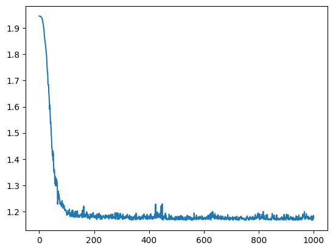
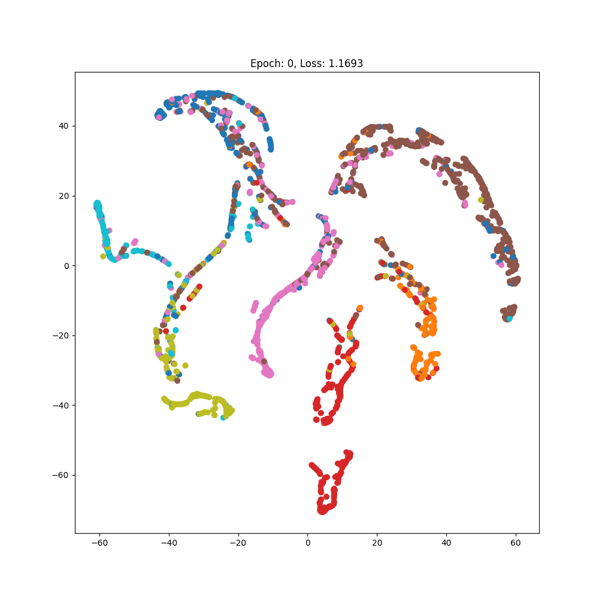

# GCN for Cora Dataset

This project implements a Graph Convolutional Network (GCN) to classify papers in the Cora citation network dataset using PyTorch Geometric. The implementation is provided in a Jupyter Notebook.

## Overview

- Implements a GCN model for node classification
- Uses the Cora dataset from PyTorch Geometric
- Visualizes training loss and node embeddings

## Requirements

- Python 3.x
- Jupyter Notebook
- PyTorch
- PyTorch Geometric
- Matplotlib
- Seaborn

## Usage

1. Install the required packages:
   ```
   pip install jupyter torch torch_geometric matplotlib seaborn
   ```

2. Start Jupyter Notebook:
   ```
   jupyter notebook
   ```

3. Open the `Cora_gnn.ipynb` file in the Jupyter Notebook interface.

4. Run all cells in the notebook to train the model and generate visualizations.

## Results

- Test Accuracy: 0.703
- The notebook generates and displays:
  - A plot of the training loss
  - A GIF showing the evolution of node embeddings

## Visualizations

### Training Loss



### Node Embeddings Evolution


## Future Work

- Experiment with different GNN architectures
- Apply to other citation network datasets

## Author

[chirag1701](https://github.com/chirag1701)

## License

This project is open-source and available under the MIT License.
